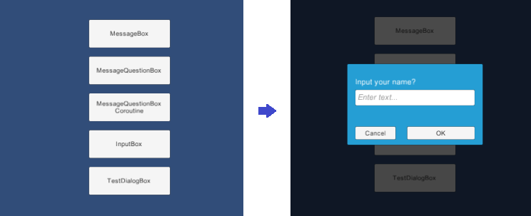
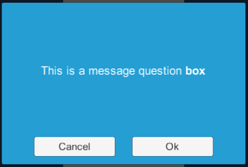
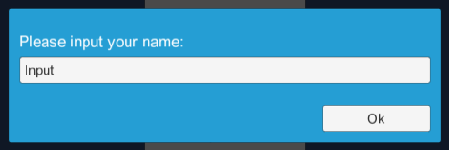

# UiManager for Unity3D

### Features

* Modal dialog management.
* Common dialog boxes such as MessageBox and InputBox.

### How to use

#### Modal Dialog management.



This library provides basic modal dialog managements on Unity-GUI.
Modal dialog box works like a function which gets input argument, does work, and returns return value.
When a modal dialog box shows, input of other windows beyond showing dialog box will be blocked.

```csharp
// show up TestDialogBox with an arugment
var handle = UiManager.Instance.ShowModalRoot<TestDialogBox>("Input your name?");
// waits for dialog to finish it's work
yield return StartCoroutine(handle.WaitForHide());
// gets return value from dialog
Debug.Log(handle.ReturnValue);
```

##### Define modal dialog box

DialogBox should inherit `UiDialog`.
When dialog box shows up, `OnShow` handler will be invoked with `param` is passed by `ShowModalRoot`.
When work done and there is a return value, `Hide` method can be used.

```csharp
//
public class TestDialogBox : UiDialog
{
    public override void OnShow(object param)
    {
        // gets an argument from caller
        Message.text = (string)param;
        Input.text = "";
    }

    public void OnOkButtonClick()
    {
        // returns values to caller
        Hide(Input.text);
    }
}
```

##### Show modal dialog

It's quite simple to show modal dialog boxes but there are several ways for showing dialog box.

* `ShowModalPrefab`: Use the prefab dialog box. Whenever show up new dialog, dialog box will be instantiated.
* `ShowModalTemplate`: Use the template dialog box in the scene. Whenever show up new dialog, dialog box will be cloned.
* `ShowModal<T>`: Use a passed dialog box whose type is T.
* `ShowModalRoot<T>`: Use a named dialog box under `Canvas/DialogBox` in the scene.

For getting return value of it, there are two ways.

First one is using `Hidden` callback.

```csharp
var handle = UiManager.Instance.ShowModalRoot<TestDialogBox>("Input your name?");
handle.Hidden += (dlg, val) => { Debug,Log(val); };
```

Second one is using coroutine. It's quite useful under modal chaining.

```csharp
var handle = UiManager.Instance.ShowModalRoot<TestDialogBox>("Input your name?");
yield return StartCoroutine(handle.WaitForHide());
Debug.Log(handle.ReturnValue);
```

#### Common dialog boxes.

##### Common message box



```csharp
UiMessageBox.Show("This is a message question <b>box</b>",
                  UiMessageBox.QuestionType.OkCancel,
                  r => { /* Callback */ });
```

##### Common input box



```csharp
UiInputBox.Show("Please input your name:",
                "Input",
                r => { /* Callback */ });
```
